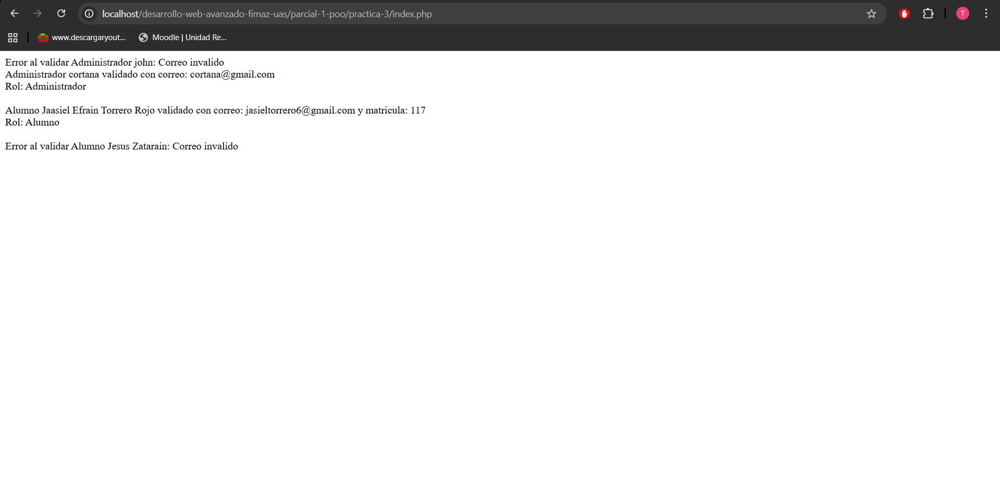

# Práctica 3 - sistema de usuarios con validaciónes y excepciónes

## Descripción del sistema

En esta práctica se desarrolla un sistema sencillo usando **Programación Orientada a Objetos en PHP**.
Se crea una clase base llamada **Usuario**, la cual contiene los datos principales como el nombre y el correo electrónico.
El sistema valida que el correo este escrito correctamente antes de guardar la información.

## Explicación del flujo de clases

La clase **Usuario** funciona como clase principal del sistema apartir de ella se crean dos clases que heredan sus propiedades y métodos:

* **Admin**: representa a un administrador del sistema.
* **Alumno**: representa a un alumno y además incluye el atributo matrícula.

En el archivo `index.php` se crean objetos de estas clases para probar su funcionamiento y mostrar la información en pantalla.

## Evidencia del manejo de errores

Para evitar errores en el sistema se utiliza `try-catch`.
Esto permite capturar excepciones cuando se ingresa un correo inválido.

